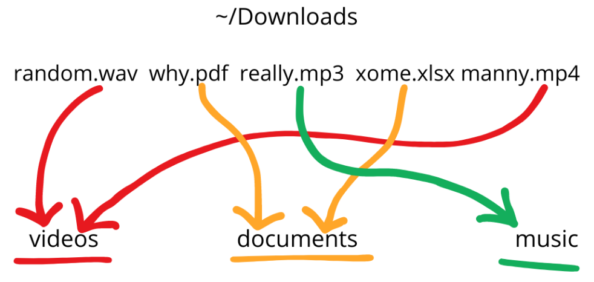

# extension-express

CLI utility designed to streamline workspace organization

## idea

extensions-express simplifies the organization of directories containing numerous files, such as _~/Downloads_. It offers efficient file management, making it easier to organize and navigate through your files. Automation categorizes files found in the provided directory based on their file extensions and then moves them to designated locations according to their respective types.


## Download and install

```bash
git clone https://github.com/alojine/extension-express.git
cd extension-express
```

**Run with intepreter**

```bash
lua exp.lua
```

**Make executable**

```bash
chmod +x exp.lua
./exp.lua
```

## Commands and Options

- `-clean [directory]` Clean up files in the specified directory based on their extensions.
- `-defaults` Show default settings.
- `-move` Move files with a specific extension to a different category.
- `-create-cat [category] [directory]` Create a new category with the specified directory.
- `-create-ext [extension] [category]` Create a new extension under the specified category.
- `-remove-cat [category]` Remove the specified category.
- `-remove-ext [extension]` Remove the specified extension from its category.
- `-reset` Reset configuration settings to default.
- `-help` Show usage instructions.

## Dependencies

- Lua 5.1 and above
- lua-csjon

## Configuration

You can configure extension-express by editing the configuration files **(defaults.json config.lua)** provided in the repository for personal preferences.
